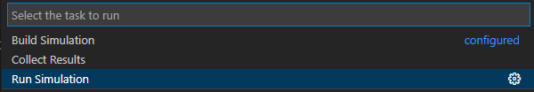
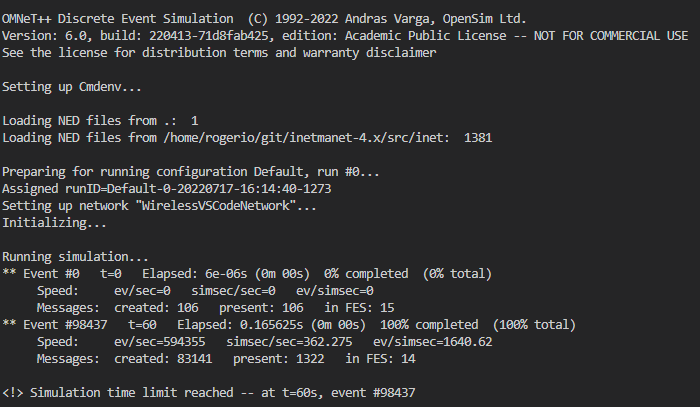
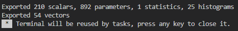
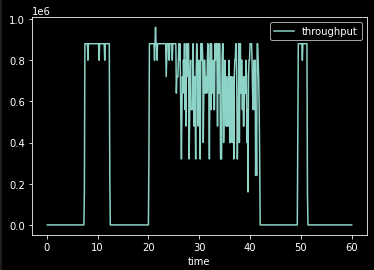

# omnetpp-vscode
An Hygienic Setup for Running OMNeT++ Simulations on VSCode


This repository contains an example of [Visual Studio Code](https://code.visualstudio.com/) configuration for running [OMNeT++](https://omnetpp.org/) simulations. The main idea is getting rid of the Eclipse IDE and being able to use the full power of VSCode extensions and flexibility while dealing with network simulations.

Being and initial setup, this tutorial will be restricted to only running a simple simulation based on custom .NED files. Future extensions are planned to be published showing how to extend the setup for building new files from `.h` and `.cc` source code. Another future extension is to show a setup for running coupled simulations such as Veins-OMNeT++ integration in VSCode, which can be done easily by VSCode C++ developers. The current tutorial implements a setup for running OmNET++ simulations that use models from the INET Framework.

## Environment Setup

This example setup in configured using the Windows Subsystem for Linux ([WSL](https://docs.microsoft.com/en-us/windows/wsl/install)) with an Ubuntu 20.04 image. The chosen version of OMNeT++ is the [6.0](https://github.com/omnetpp/omnetpp/releases/tag/omnetpp-6.0) and the example project uses the [INET Framework v4.4.0](https://github.com/inet-framework/inet) with support for a number of community-implemented resources.

However, despite the chosen versions for the environment setup, there are no specific dependencies for the chosen versions and the setup is likely to work without issues on older versions of OMNeT++ and different versions of INET.

### OMNeT++ Installation

For the OMNeT++ installation in the WSL environment, no changes have to be made with respect to the official [installation guide](https://doc.omnetpp.org/omnetpp/InstallGuide.pdf) for the Ubuntu Linux. However, in the `configure.user` file the installation of resources related to OSGEarth and QTEnv can be disabled, since only the command line environment of OMNeT++ (`cmdenv`) will be used.

### INET Framework compilation

For the INET Framework, the official instalation guide can be followed closely. One issue that can be detected is the name of the generated `libINET.so` file, result of the building process. Depending on the version, it can expect `libinet.so` instead of the capital version. Just renaming the static file can solve the problem.

## Configuration Files
As the Eclipse IDE does a lot of configuration in the background, one can never escape from doing an small amount of configuration manually when migrating from an IDE to a custom text editor. However, VSCode makes this easy with the `settings.json` configuration files, the `tasks.json` extensible tasks and the `c_cpp_properties.json` extra configurations from the Official C/C++ Extension.

**NOTE**: Some of the configurations here can be ignored for this tutorial, but will be included in preparation for future setups, since they are simple and fast to make.


The configuration files can be found in the `.vscode` directory. The `c_cpp_properties.json` and `tasks.json` files need no user editing for running this specific example, but may be improved in the future, for support more complicated setups.


### settings.json

This configuration file should be edited by the user before running any simulation. Each of the configuration variables should be set to the desired values:

- `omnetppInstallDir` should point to the installation directory of the OMNeT++ in the system.

- `inetDir` should point to the directory where the INET Framework repository was cloned and built.

- `simulationConfig` should receive the name of the desired configuration to be executed (defined in the `omnetpp.ini` file).

```json
{
    "omnetppInstallDir": "/home/rogerio/omnetpp",
    "inetDir": "/home/rogerio/git/inet",
    "simulationConfig": "Default"
}
```

## Running

For executing the simulation in VSCode, one might use the `command palette` (CTRL+Shift+P on Windows) and choose the `Run Task` command. An alternative way of doing this is using the `Terminal -> Run Task` options in the VSCode menu.

When the `Run Task` command is invoked, three task options are displayed for the user. In this simple example, the `Build Simulation` task is not necessary, since we only use NED files in our network and the `.h` and `.cc` files are already built with INET.




For running the simulation, one can select the `Run Simulation` task, and an terminal will open, where the OMNeT++ cmdenv executable will be invoked.



## Collecting Results

It is considered a nice approach using jupyter notebooks for data analysis with Python. In this project, the `results` folder contains a `.ipynb` file which can be used in VSCode with the Python extension for analyzing the simulation outcome.

However, some preprocessing is needed. The `.vec` and `.sca` files from OMNeT++ must be converted to some format that can be read from inside the data analysis environment, such as `.csv`. We can do this using the `scavetool` from OMNeT++, which is already configured to run in the `Collect Results` task.




By following the content of the `analysis.ipynb` one can generate the desired results.


